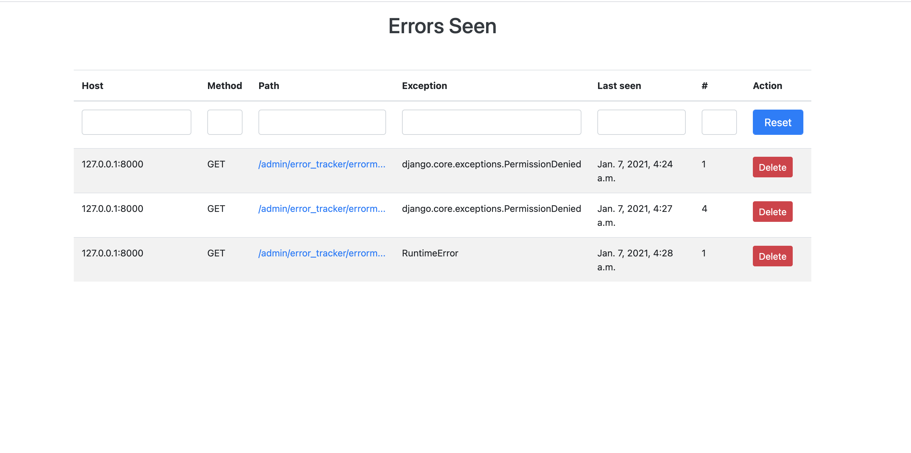

=============
Error Tracker
=============

Error Tracker is a python app plugins for Flask and Django, that provides many of the essentials features of system exceptions tracking.

Features
--------
  -  Mask all the variables, including dict keys, HTTP request body which contain *password* and  *secret* in their name.
  -  Recorded exceptions will be visible to the configured path
  -  Send notification on failures
  -  Record exceptions with frame data, including local and global variables
  -  Raise bugs or update ticket in Bug tracking systems.
  -  Provide customization for notification, context building, ticketing systems and more

**Exception Listing**

**Detailed Exception**

.. image:: images/detail-page.png
    :alt: Detailed Exception page

Quick start
===========

Installation
------------

To install Error Tracker, open an interactive shell and run:

.. code::

    pip install error-tracker

Error Tracker can be used with

*  Standalone Python application
*  Flask Application
*  Django Application

Using **Error Tracker** as simple as plugging any other module.

Recording exception/error
-------------------------
An error/exception can be recorded using decorator or function call.
- To record the error using decorator, decorate a function with *track_exception* or *auto_track_exception*
- Where as to record error using function call use  *record_exception* function.

All the data will be stored in the configured data store and these data will be available at configure URL path.

Flask App setup
-------------------
An instance of *AppErrorTracker* needs to be created and have to be configured with the correct data.
Monitoring feature can be configured either using object based configuration or app-based configuration,
the only important thing here is we should have all the required key configs in the app.config otherwise it will fail.

For object based configuration add
**settings.py**

.. code::

    ...
    APP_ERROR_SEND_NOTIFICATION = True
    APP_ERROR_RECIPIENT_EMAIL = ('example@example.com',)
    APP_ERROR_SUBJECT_PREFIX = "Server Error"
    APP_ERROR_EMAIL_SENDER = 'user@example.com'

**app.py**

.. code::

    from flask import Flask
    from flask_mail import Mail
    import settings
    from error_tracker import AppErrorTracker, NotificationMixin
    from flask_sqlalchemy import SQLAlchemy
    ...
    app = Flask(__name__)
    app.config.from_object(settings)
    db = SQLAlchemy(app)
    class Notifier(Mail, NotificationMixin):
        def notify(self, request, exception,
                   email_subject=None,
                   email_body=None,
                   from_email=None,
                   recipient_list=None):
            message = Message(email_subject, recipient_list, email_body, sender=from_email)
            self.send(message)
    mailer = Notifier(app=app)
    error_tracker = AppErrorTracker(app=app, db=db, notifier=mailer)

    ....

    ....
    # Record exception when 404 error code is raised
    @app.errorhandler(403)
    def error_403(e):
        error_tracker.record_exception()
        # any custom logic

    # Record error using decorator
    @app.errorhandler(500)
    @error_tracker.track_exception
    def error_500(e):
        # some custom logic
    ....

Here, app, db and notifier parameters are optional. Alternatively, you could use the init_app() method.

If you start this application and navigate to http://localhost:5000/dev/error, you should see an empty page.

Django App Setup
----------------

We need to update settings.py file as

-  Add app to installed apps list
-  Add Middleware for exception tracking. This should be added at the end so that it can process exception 1st in the middleware call stack.
-  Other configs related to notification
-  Add URLs to the list of URL patterns

.. code::

    ...
    APP_ERROR_RECIPIENT_EMAIL = ('example@example.com',)
    APP_ERROR_SUBJECT_PREFIX = "Server Error"
    APP_ERROR_EMAIL_SENDER = 'user@example.com'

    INSTALLED_APPS = [
        ...
        'error_tracker.DjangoErrorTracker'
    ]
    MIDDLEWARE = [
        ...
        'error_tracker.django.middleware.ExceptionTrackerMiddleWare'
    ]

We need to add URLs to the urls.py so that we can browse the default pages provided by Error Tracker

.. code::

    from error_tracker.django import urls

    urlpatterns = [
        ...
        url("dev/", include(urls)),
    ]

Using With Python App (NO WEB SERVER)
-------------------------------------
Choose either of the preferred framework, flask or Django and configure the app as per their specifications.
For example, if we want to use Flask then do

- Flask App
    * Create Flask App instance
    * Create Error Tracker app instance
    * DO NOT call run method of Flask app instance
    * To track exception call :code:`error_tracker.record_exception` method

- Django App
    * Create Django App with settings and all configuration
    * Set environment variable  **DJANGO_SETTINGS_MODULE**
    * call :code:`django.setup()`
    * :code:`from error_tracker.django.middleware import error_tracker`
    * To track exception do :code:`error_tracker.record_exception(None, exception)`

.. toctree::

    Flask App <flask-app>
    Django App <django-app>
    Notification Sender <notification>
    Raise or Update BUG <ticketing>
    Masking <mask-rule>
    Custom Context Provider <context-builder>
    Persistence Store <datastore>

.. automodule::
    error_tracker